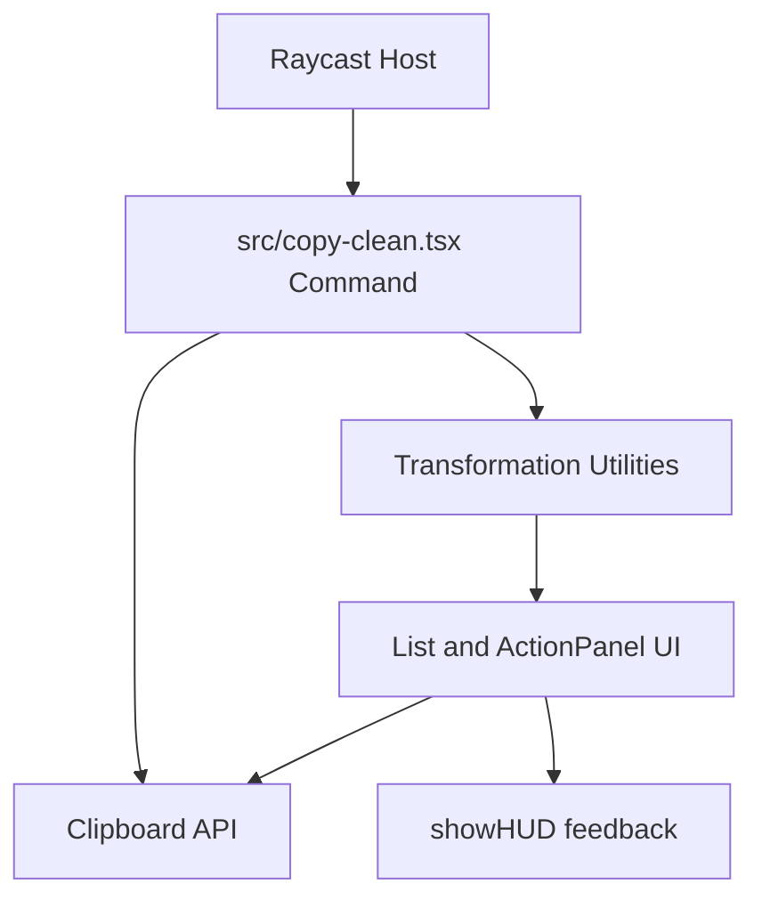
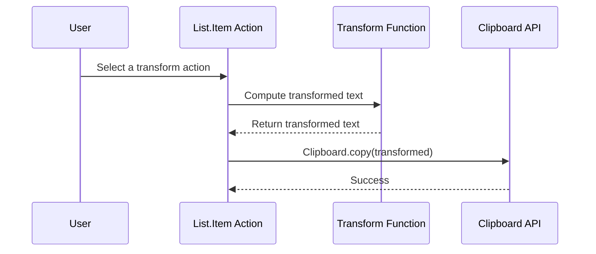

<!-- refreshed: 2026-05-20 -->
# Architecture

**Analysis Date:** 2026-05-20

## System Overview

This project uses a single-command, module-centric architecture where all runtime behavior lives in `src/copy-clean.tsx`.

The extension metadata in `package.json` registers the `copy-clean` command and maps execution into Raycast.

## Component Responsibilities

| Component | Responsibility | File |
|-----------|----------------|------|
| Command entry | Reads clipboard text, renders UI list, wires actions | `src/copy-clean.tsx` |
| Transformation layer | Encapsulates text normalization and cleanup operations | `src/copy-clean.tsx` |
| Extension manifest | Declares command name, mode, and dependencies | `package.json` |
| Static assets | Provides extension icon | `assets/icon.png` |
| Tooling config | TypeScript and linting constraints | `tsconfig.json`, `eslint.config.js` |

## Pattern Overview

**Overall:** Single-module functional pipeline.

**Key Characteristics:**

- Entry point, UI, and transformation logic are colocated in one command module.
- Clipboard access occurs at boundaries through `Clipboard.readText()` and `Clipboard.copy()`.
- Transformations are selected through a label-to-function dictionary and applied on demand.

## Layers

**Host Integration Layer:**

- Purpose: Connect Raycast runtime with extension command behavior.
- Location: `package.json`, `src/copy-clean.tsx` imports from `@raycast/api`.
- Contains: Command metadata and API calls.
- Depends on: Raycast extension host.
- Used by: All runtime code paths.

**Application Logic Layer:**

- Purpose: Implement text transformations and selection mapping.
- Location: `src/copy-clean.tsx`.
- Contains: Utility functions (`toUrlSafe`, `removeEmojis`, `removeHTMLTagsAndEntities`) and `transformations` mapping.
- Depends on: JavaScript string and regex operations.
- Used by: Render and action handlers.

**Presentation Layer:**

- Purpose: Render choices and trigger copy actions.
- Location: `src/copy-clean.tsx` JSX tree (`List`, `List.Item`, `ActionPanel`, `Action`).
- Contains: Dynamic list rendering from transformation mapping.
- Depends on: React hooks and Raycast UI components.
- Used by: End users in Raycast UI.

## Data Flow

### Primary Request Path

1. Raycast invokes command defined in `package.json` (`commands[0].name = "copy-clean"`).
2. `Command` mounts in `src/copy-clean.tsx` and `useEffect` calls `Clipboard.readText()`.
3. Current clipboard value is stored in local component state (`clipboardText`).
4. UI renders one row per entry in `transformations` using `Object.entries(transformations)`.
5. User selects `Copy to Clipboard` and handler runs `Clipboard.copy(transformed)`.
6. Feedback is shown through `showHUD` to confirm successful write.

### Transformation Subflow

**State Management:**

- React local state only (`clipboardText` in `useState`).
- No external store, cache, or persisted state.

## Key Abstractions

**Transformation Function:**

- Purpose: Define a pure text-to-text conversion.
- Examples: `toUrlSafe`, `toSentenceCase`, `removeHTMLTagsAndEntities` in `src/copy-clean.tsx`.
- Pattern: Function dictionary keyed by human-readable label (`transformations`).

**Command Component:**

- Purpose: Bridge clipboard I/O, transformation selection, and UI rendering.
- Examples: default export `Command` in `src/copy-clean.tsx`.
- Pattern: React function component with one effect and derived render output.

## Entry Points

**Raycast Command Entry Point:**

- Location: `src/copy-clean.tsx`.
- Triggers: Raycast command execution from launcher.
- Responsibilities: Load clipboard text, present transformation options, apply and copy chosen output.

## Architectural Constraints

- **Threading:** Single-threaded event loop with async clipboard operations.
- **Global state:** No module-level mutable state outside function constants.
- **Circular imports:** Not detected.
- **Module boundary:** Single source module means high local coupling between UI and transformations.

## Error Handling

**Strategy:** Optimistic async operations without explicit try/catch.

**Patterns:**

- Clipboard read ignores falsy values and leaves UI loading state active until text is set.
- Clipboard write assumes success and immediately shows HUD.

## Cross-Cutting Concerns

**Logging:** No explicit runtime logging in `src/copy-clean.tsx`.

**Validation:** Implicit input handling via string operations and regex patterns.

**Configuration:** Runtime behavior configured primarily by `package.json`, `tsconfig.json`, and `eslint.config.js`; workflow automation assets reside under `.github/`.

---

*Architecture analysis: 2026-05-20*
