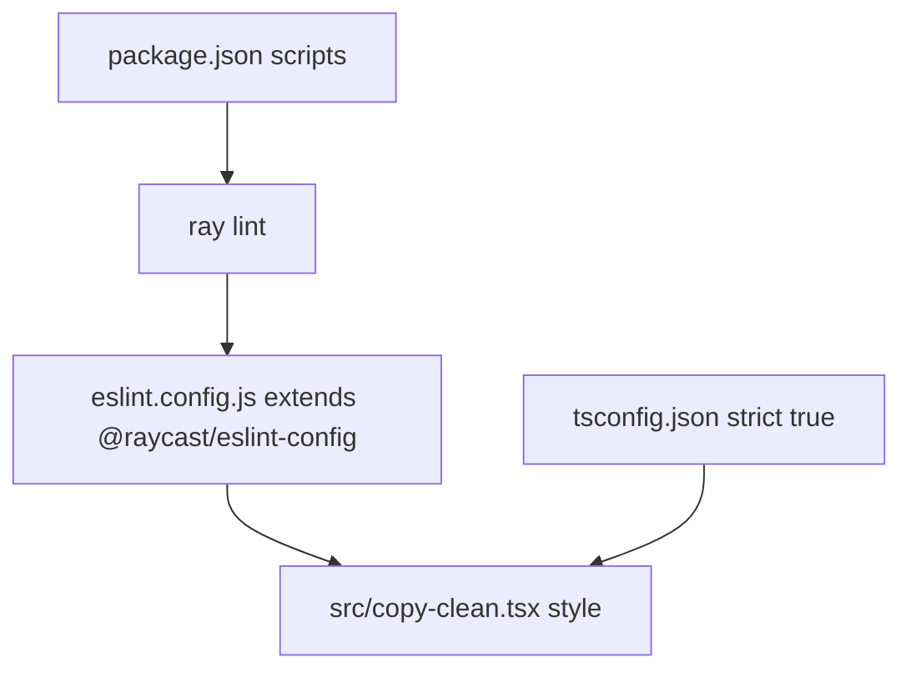

# Coding Conventions

**Analysis Date:** 2026-05-20

## Evidence Base

- Primary implementation reviewed: `src/copy-clean.tsx`
- Lint configuration reviewed: `eslint.config.js`
- Compiler configuration reviewed: `tsconfig.json`
- Scripts and dependency policy reviewed: `package.json`
- Project overview reviewed: `README.md`

## Convention Relationship Map

## Naming Patterns

**Files:**

- Use kebab-case for command files in `src/`, e.g. `src/copy-clean.tsx`.

**Functions:**

- Use camelCase for utility functions, e.g. `toUrlSafe`, `toSentenceCase`, `capitalizeWords`, `removeEmojis`, `decodeHtmlEntities`, and `removeHTMLTagsAndEntities` in `src/copy-clean.tsx`.
- Use PascalCase for React component exports, e.g. `Command` in `src/copy-clean.tsx`.

**Variables and Constants:**

- Use camelCase for state and local variables, e.g. `clipboardText`, `setClipboardText`, and `transformed` in `src/copy-clean.tsx`.
- Use descriptive object names for registries, e.g. `transformations` in `src/copy-clean.tsx`.

## Code Style

**Formatting and Linting Source of Truth:**

- `eslint.config.js` exports `defineConfig([...raycastConfig])` from `@raycast/eslint-config`.
- `package.json` defines lint commands via Raycast tooling: `npm run lint` and `npm run fix-lint`.
- `package.json` includes `prettier` and `eslint` devDependencies.

**TypeScript Strictness:**

- `tsconfig.json` enforces `strict: true`, `isolatedModules: true`, and `forceConsistentCasingInFileNames: true`.
- Prefer explicit type annotations on non-trivial functions, as used by `decodeHtmlEntities` and `removeHTMLTagsAndEntities` in `src/copy-clean.tsx`.

## Import Organization

- Import external packages first, then React hooks.
- Current pattern in `src/copy-clean.tsx`:
  - `@raycast/api`
  - `react`
- Keep imports at module top and avoid dynamic imports unless required.

## Function and Module Design

- Keep pure text-transformation helpers as top-level constants with arrow functions in `src/copy-clean.tsx`.
- Aggregate user-selectable operations in a single mapping object (`transformations`) keyed by UI labels in `src/copy-clean.tsx`.
- Export one default command component per Raycast command file, as shown by `export default function Command()` in `src/copy-clean.tsx`.

## Error Handling and Logging

- No explicit try/catch or centralized error boundary is present in `src/copy-clean.tsx`.
- Clipboard initialization uses promise chaining with a null guard (`if (text)`) in `src/copy-clean.tsx`.
- Logging is not used in the current command flow.
- For new code, prefer user-visible Raycast feedback (`showHUD`) over console output for successful interactive actions.

## Comments and Documentation

- `src/copy-clean.tsx` uses section-divider comments to organize related blocks.
- Inline comments are used sparingly to explain regex intent (for example, accent and punctuation removal in `toUrlSafe`).
- Keep comments focused on rationale or non-obvious transforms.

## Prescriptive Rules for New Code

- Place new Raycast command logic in `src/` using kebab-case filenames aligned with command names in `package.json`.
- Follow strict TypeScript settings from `tsconfig.json`; do not weaken compiler options for convenience.
- Keep transformation helpers pure and side-effect free.
- Keep user actions inside `Action` callbacks and provide confirmation with `showHUD`.
- Run `npm run lint` before considering a change complete.

---

*Convention analysis: 2026-05-20*