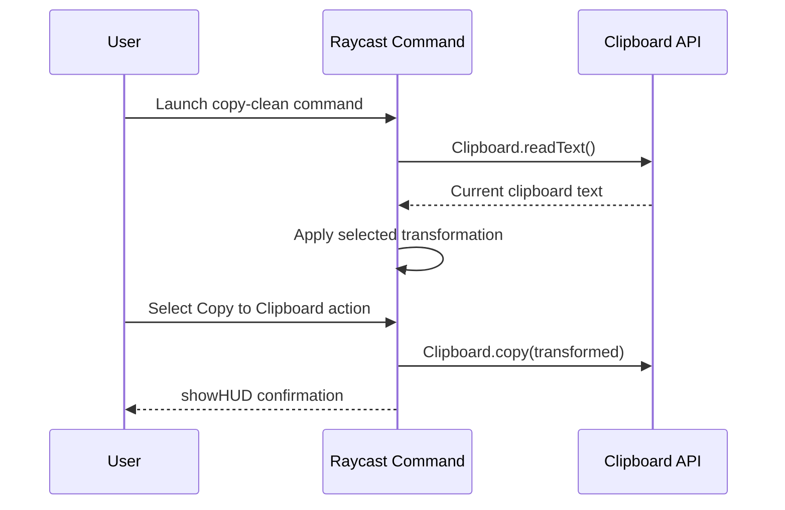

# External Integrations

**Analysis Date:** 2026-05-20

## APIs & External Services

**Runtime Platform Services:**

- Raycast host runtime - Executes the `copy-clean` command declared in `package.json`
  - SDK/Client: `@raycast/api`
  - Auth: Not applicable (local extension host context)

**Operating System Clipboard:**

- System clipboard access through Raycast API wrappers in `src/copy-clean.tsx`
  - SDK/Client: `Clipboard` from `@raycast/api`
  - Auth: Not applicable (local OS permission model handled by host app)

**Network/API Providers:**

- Not detected (no `fetch`, Axios, or external HTTP client usage in `src/copy-clean.tsx`)

## Data Storage

**Databases:**

- Not detected
  - Connection: Not applicable
  - Client: Not applicable

**File Storage:**

- Local project files only (`src/copy-clean.tsx`, `package.json`, `README.md`)

**Caching:**

- None detected (`LocalStorage` usage not present in `src/copy-clean.tsx`)

## Authentication & Identity

**Auth Provider:**

- No application-level authentication provider detected
  - Implementation: Command runs locally in Raycast without custom auth flows

## Monitoring & Observability

**Error Tracking:**

- None detected (no Sentry/App Insights/Datadog/New Relic SDKs in `package.json`)

**Logs:**

- No explicit logging integration detected in `src/copy-clean.tsx`

## CI/CD & Deployment

**Hosting:**

- Raycast extension distribution flow indicated by `publish` script in `package.json`

**CI Pipeline:**

- Not detected (no GitHub Actions workflow files observed in `.github/workflows`)

## Environment Configuration

**Required env vars:**

- None detected (no `process.env` reads in `src/copy-clean.tsx`)

**Secrets location:**

- Not applicable for current implementation

## Webhooks & Callbacks

**Incoming:**

- None

**Outgoing:**

- None

---

*Integration audit: 2026-05-20*
