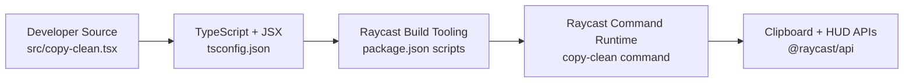

# Technology Stack

**Analysis Date:** 2026-05-20

## Languages

**Primary:**

- TypeScript (strict mode) - Extension command implementation in `src/copy-clean.tsx`
- TSX (React JSX in TypeScript) - Raycast UI command component in `src/copy-clean.tsx`

**Secondary:**

- JavaScript (CommonJS) - Tooling config in `eslint.config.js`
- Markdown - Project docs in `README.md` and `CHANGELOG.md`
- JSON - Extension manifest and compiler config in `package.json` and `tsconfig.json`

## Runtime

**Environment:**

- Node.js runtime used by Raycast extension tooling (`ray build`, `ray develop`) in `package.json`
- Raycast host application executes the command declared in `package.json` (`commands[0].name = copy-clean`)

**Package Manager:**

- npm (via `package-lock.json` and npm script conventions in `package.json`)
- Lockfile: present (`package-lock.json`)

## Frameworks

**Core:**

- Raycast API (`@raycast/api` ^1.103.2) - Command UI primitives, clipboard access, HUD in `src/copy-clean.tsx`
- React 19 type ecosystem (`@types/react` 19.0.10) - Hook and JSX typing used in `src/copy-clean.tsx`

**Testing:**

- Not detected (no Jest/Vitest/Mocha dependencies or test files)

**Build/Dev:**

- Raycast CLI scripts (`ray build`, `ray develop`, `ray lint`) in `package.json`
- TypeScript compiler (`typescript` ^5.8.2) configured by `tsconfig.json`
- ESLint 9 + `@raycast/eslint-config` configured in `eslint.config.js`
- Prettier 3 (`prettier` ^3.5.3) declared in `package.json`

## Key Dependencies

**Critical:**

- `@raycast/api` ^1.103.2 - Required runtime API for command rendering and clipboard integration (`src/copy-clean.tsx`)
- `@raycast/utils` ^1.17.0 - Utility package available for extension helpers (declared in `package.json`)

**Infrastructure:**

- `@raycast/eslint-config` ^2.0.4 - Shared lint conventions (`eslint.config.js`)
- `eslint` ^9.22.0 - Static analysis (`package.json`)
- `typescript` ^5.8.2 - Type-checking and transpilation (`tsconfig.json`)
- `prettier` ^3.5.3 - Formatting (`package.json`)

## Configuration

**Environment:**

- No `.env` files detected in the workspace root.
- No `process.env` usage detected in `src/copy-clean.tsx`.
- Core extension metadata and command registration are encoded in `package.json`.

**Build:**

- TypeScript options: `module: commonjs`, `target: ES2023`, `jsx: react-jsx` in `tsconfig.json`
- Lint profile extends Raycast defaults in `eslint.config.js`
- Publish guard script in `package.json` (`prepublishOnly`) prevents accidental npm publish

## Platform Requirements

**Development:**

- Node/npm toolchain for script execution in `package.json`
- Raycast development workflow (`ray develop`) in `package.json`

**Production:**

- Raycast extension target platforms explicitly listed as macOS and Windows in `package.json`
- Distribution model aligned with Raycast Store script (`publish`) in `package.json`

---

*Stack analysis: 2026-05-20*
