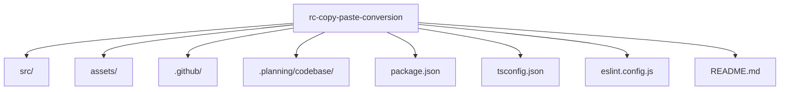

# Codebase Structure

**Analysis Date:** 2026-05-20

## Directory Layout



```text
rc-copy-paste-conversion/
├── src/                  # Runtime command implementation
│   └── copy-clean.tsx    # Raycast command UI and transformation logic
├── assets/               # Static extension assets
│   └── icon.png          # Extension icon
├── .github/              # GSD and workflow command metadata
├── .planning/codebase/   # Generated codebase mapping documents
├── package.json          # Extension manifest and npm scripts
├── tsconfig.json         # TypeScript compiler settings
├── eslint.config.js      # Lint configuration
└── README.md             # High-level project description
```

## Directory Purposes

**src/:**

- Purpose: Houses executable extension code.
- Contains: Command entry modules.
- Key files: `src/copy-clean.tsx`.

**assets/:**

- Purpose: Stores static files packaged with the extension.
- Contains: Icon/image assets.
- Key files: `assets/icon.png`.

**.github/:**

- Purpose: Stores project automation and GSD skill/workflow metadata.
- Contains: `skills/`, `agents/`, and installer state files.
- Key files: `.github/copilot-instructions.md`, `.github/skills/`.

**.planning/codebase/:**

- Purpose: Maintains generated architecture, stack, quality, and structure maps.
- Contains: Markdown analysis docs.
- Key files: `.planning/codebase/STACK.md`, `.planning/codebase/INTEGRATIONS.md`, `.planning/codebase/CONVENTIONS.md`, `.planning/codebase/TESTING.md`.

## Key File Locations

**Entry Points:**

- `src/copy-clean.tsx`: Runtime command entry and UI render tree.
- `package.json`: Command registration (`commands` array).

**Configuration:**

- `tsconfig.json`: TypeScript strictness and compiler target.
- `eslint.config.js`: Lint profile via `@raycast/eslint-config`.

**Core Logic:**

- `src/copy-clean.tsx`: String transformation functions and selection map.

**Testing:**

- Not detected in current tree (`*.test.*` and `*.spec.*` files not present).

## Naming Conventions

**Files:**

- Command file uses kebab-case: `copy-clean.tsx`.
- Config files use canonical tool names: `package.json`, `tsconfig.json`, `eslint.config.js`.

**Directories:**

- Source and asset directories use lowercase short names: `src/`, `assets/`.
- Hidden operational directories prefixed with dot: `.github/`, `.planning/`.

## Where to Add New Code

**New Raycast command:**

- Primary code: `src/<command-name>.tsx`.
- Registration: add command metadata in `package.json` under `commands`.

**New transformation utilities:**

- Implementation: colocate in `src/copy-clean.tsx` when tightly coupled to current command.
- Refactor target: introduce `src/transformations/` only when multiple command modules are added.

**New static resources:**

- Assets: place under `assets/` and reference from manifest or UI where needed.

**New codebase mapping docs:**

- Documentation output: `.planning/codebase/` using uppercase filenames like `ARCHITECTURE.md`.

## Special Directories

**.planning/:**

- Purpose: Planning and generated analysis artifacts.
- Generated: Yes.
- Committed: Yes.

**.github/skills/:**

- Purpose: Skill command definitions for GSD workflows.
- Generated: No.
- Committed: Yes.

---

*Structure analysis: 2026-05-20*
