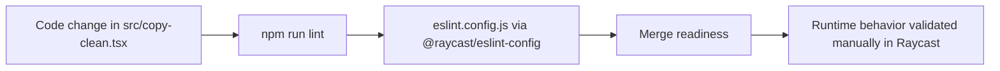

# Testing Patterns

**Analysis Date:** 2026-05-20

## Current Testing Posture

- No test runner configuration file detected (`jest.config.*` and `vitest.config.*` not present).
- No test files detected (`*.test.*` and `*.spec.*` not present in workspace scan).
- `package.json` has no `test` script.
- Quality gate currently relies on linting scripts from `package.json` (`lint`, `fix-lint`).

## Quality Flow Diagram



## Test Framework

**Runner:**

- Not detected.
- Related evidence: `package.json` scripts and dependency list.

**Assertion Library:**

- Not detected.

**Run Commands:**

```bash
npm run lint          # Current automated quality check
npm run fix-lint      # Lint autofix pass
(No npm test command is currently defined)
```

## Test File Organization

**Location:**

- Not applicable in current codebase state (no test directories or files detected).

**Naming:**

- Not applicable in current codebase state.

**Suggested Structure (to align with current layout):**

```text
src/
  copy-clean.tsx
  __tests__/
    copy-clean.test.ts
```

## Mocking

**Framework:**

- Not detected.

**Current practical boundary for future mocks:**

- `@raycast/api` methods used in `src/copy-clean.tsx` are the primary external side-effect boundary.
- Candidate functions to isolate for tests are clipboard interactions (`Clipboard.readText`, `Clipboard.copy`) and HUD feedback (`showHUD`).

## Fixtures and Factories

- No fixture or factory patterns detected.
- Natural fixture candidates are representative clipboard strings transformed by helpers in `src/copy-clean.tsx`, for example:
  - accented text for `toUrlSafe`
  - html fragments for `removeHTMLTagsAndEntities`
  - emoji-containing phrases for `removeEmojis`

## Coverage

**Requirements:**

- None enforced by repository tooling.

**Coverage command:**

```bash
(Not available because no test framework is configured)
```

## Test Types Present

**Unit Tests:**

- Not used.

**Integration Tests:**

- Not used.

**E2E Tests:**

- Not used.

## Prescriptive Testing Pattern for New Work

- Add a `test` script to `package.json` before introducing non-trivial behavior.
- Keep string transform functions in `src/copy-clean.tsx` pure so unit tests can run without UI rendering.
- Treat `@raycast/api` as an integration seam and mock it in unit tests.
- Continue running `npm run lint` as a baseline gate even after adding tests.

---

*Testing analysis: 2026-05-20*